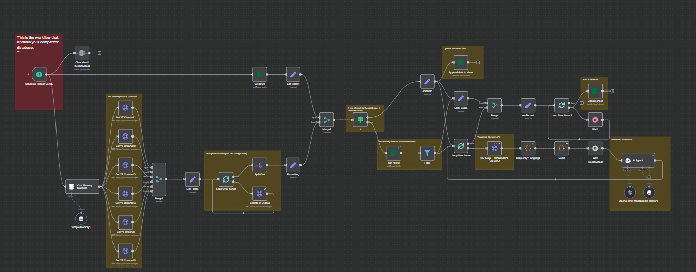
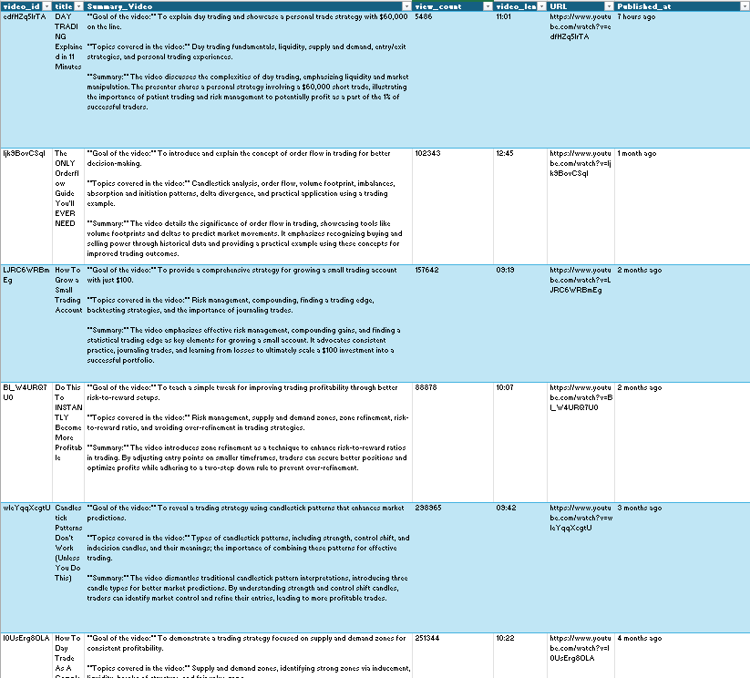
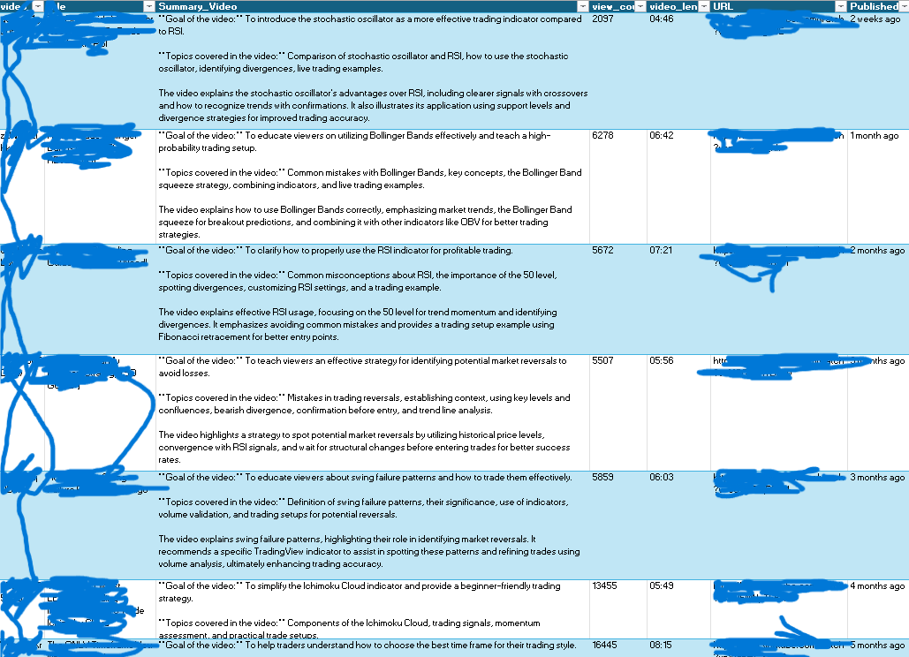
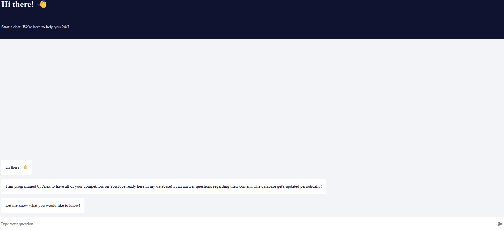

# YouTube Competitor Analysis Agent — n8n + RAPID API + AI (Personal Learning Repo)

> ⚠️ **Custom project built for a friend.** This is not a general-purpose template; it documents how I automated competitor research for a collaborative video editor workflow.

---

## Goal & Scope

This automation reduces the manual grind of competitor analysis. It:
- Scrapes competitor and own-channel videos (metadata + transcripts).
- Builds two Excel-based databases (Competitors + Our Channel).
- Summarizes each video (goal, topics, 50‑word overview).
- Exposes everything to an **AI agent** so you can ask questions instead of watching hours of content.

It’s tailored to our exact Excel schema, channel list, and credentials.

---

## What’s inside

- `competitor-analysis-agent.n8n.json` — the n8n workflow export you can import.

### Workflow at a glance

### Competitor database (example)

### Our own channel database (redacted)

### Chat window with the AI agent

---

## How it works

1. **Data Collection (Competitors + Own Channel)**  
   - Periodically scrapes YouTube channels via RAPID API endpoints.  
   - Collects: `video_id`, `title`, `view_count`, `video_length`, `URL`, `published_at`, and **transcripts**.  
   - Writes into two Excel tables: **Competitors** and **Our Channel**.

2. **AI Summarization & Enrichment**  
   - Cleans SRT captions → plain text.  
   - AI generates concise summaries with: *Goal of the video*, *Topics covered*, and a max‑50‑word **Summary**.  
   - Stores the summary next to each row.

3. **Ask the Database (Agent as Tooling)**  
   - An AI agent is connected to both sheets and answers questions like:  
     - “What topics did competitors post in the last month?”  
     - “Which themes correlate with higher views?”  
     - “Give 5 content ideas we haven’t covered yet.”  

4. **Planned**  
   - Weekly email digest of new competitor uploads + suggested ideas.

---

## Importing the workflow (n8n)

1. Open n8n → **Workflows** → **Import from File**.  
2. Select `workflow/competitor-analysis-agent.n8n.json`.  
3. Update your environment:  
   - RAPID API keys & endpoints.  
   - Excel workbook / worksheet / table IDs.  
   - OpenAI (or compatible) credentials and model names.  
   - Channel list (competitors + own channel).  
4. Run with a small channel set first and monitor Executions.

> If your Excel schema differs, adjust the Set/Append/Update field mappings in the workflow.

---

## Safety & privacy

- Screenshots may be redacted; channel IDs, workbook IDs, and API keys must be replaced with your own.
- Keep secrets in n8n **Credentials**, not inside nodes.
- Transcripts can include names/PII; handle and share responsibly.

---

© 2025 — Personal learning project.
